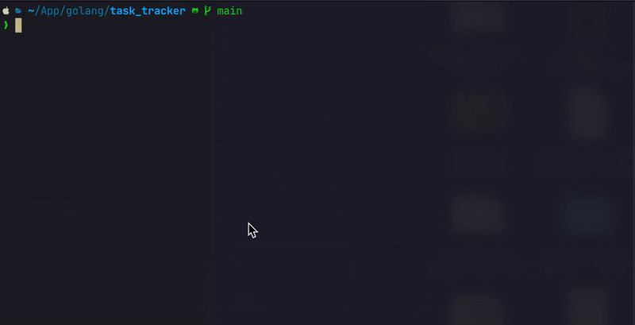

# GO_TASK_TRACKER

<!--toc:start-->

- [GO_TASK_TRACKER](#gotasktracker)
  - [What we learn](#what-we-learn)
  - [How to run](#how-to-run)
    - [Build](#build)
    - [Run](#run)
    <!--toc:end-->

CRUD CLI task json file.

<p align="center">
  
</p></p>

## What we learn

- Filesystem with os package
- CLI with [Cobra](https://cobra.dev/)

## How to run

### Build

```bash
make build
```

### Run

```bash
task_tracker [command] [flag]
```
